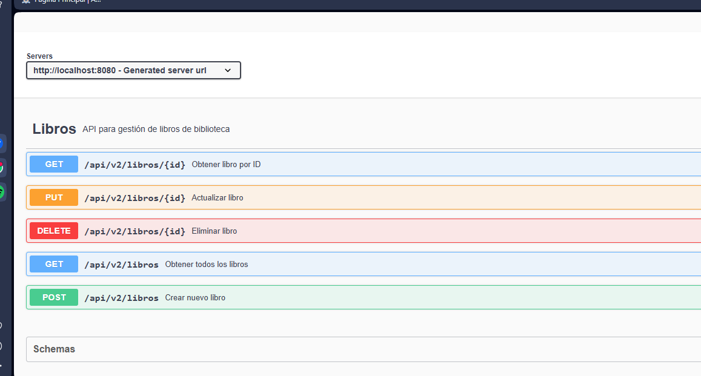
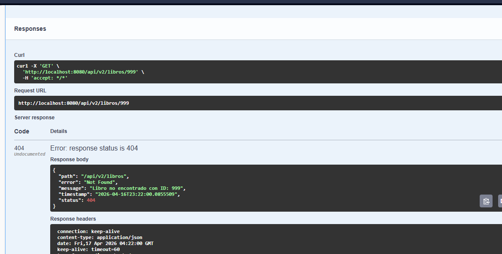
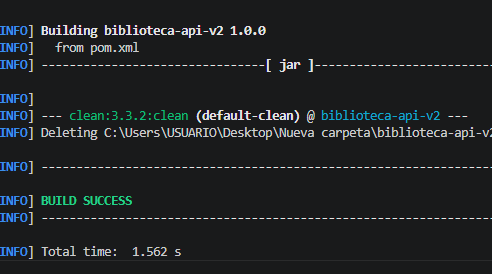

# Biblioteca API v2

API REST para gestión de biblioteca desarrollada con Spring Boot 3.2.0 y Java 25.

## Descripción

Este proyecto es una API RESTful para la gestión de libros en una biblioteca, implementando el patrón de diseño MVC con DTOs, Mapper, Service y Controller. Incluye documentación interactiva con Swagger.

## Características

- CRUD completo de libros
- Documentación automática con Swagger/OpenAPI
- Manejo centralizado de excepciones
- Validación de datos
- Arquitectura limpia con separación de responsabilidades

## Estructura del Proyecto

```
src/main/java/com/universidad/patrones/
├── dto/              # Data Transfer Objects
│   ├── LibroRequestDTO.java
│   └── LibroResponseDTO.java
├── mapper/           # Conversión entre entidades y DTOs
│   └── LibroMapper.java
├── exception/        # Manejo de excepciones
│   └── GlobalExceptionHandler.java
├── service/          # Lógica de negocio
│   └── LibroService.java
├── controller/       # Endpoints de la API
│   └── LibroControllerV2.java
├── model/            # Entidades del dominio
│   └── Libro.java
└── BibliotecaApiApplication.java
```

## Requisitos Previos

- JDK 17 o superior
- Maven 3.8+
- IDE (VS Code, IntelliJ, Eclipse)

## Configuración del JDK en VS Code

1. Instalar la extensión "Extension Pack for Java"
2. Presionar `Ctrl+Shift+P` y buscar "Java: Configure Java Runtime"
3. Seleccionar el JDK 17 instalado
4. Guardar y reiniciar VS Code

## Ejecución del Proyecto

### Desde terminal:
```bash
cd biblioteca-api-v2
mvn spring-boot:run
```

### Desde VS Code:
1. Abrir el proyecto en VS Code
2. Presionar `F5` o hacer clic en el botón "Run" en la clase principal
3. Verificar en la terminal que aparezca: "Started BibliotecaApiApplication"

## Endpoints de la API

| Método | Endpoint | Descripción |
|--------|----------|-------------|
| GET | /api/v2/libros | Listar todos los libros |
| GET | /api/v2/libros/{id} | Obtener libro por ID |
| POST | /api/v2/libros | Crear nuevo libro |
| PUT | /api/v2/libros/{id} | Actualizar libro |
| DELETE | /api/v2/libros/{id} | Eliminar libro |

## Documentación Swagger

Una vez iniciado el proyecto, accede a:
- **Swagger UI**: http://localhost:8080/swagger-ui.html
- **Documentación JSON**: http://localhost:8080/v3/api-docs

## Capturas de Pantalla

### 1. Swagger UI - Lista de Endpoints
![Swagger UI] 

### 2. Error 404 - Libro no encontrado
![Error 404]

### 3. Terminal - Aplicación iniciada correctamente
![Terminal] 
## Ejemplos de Uso

### Crear un libro (POST)
```json
{
  "titulo": "Cien Años de Soledad",
  "autor": "Gabriel García Márquez",
  "anio": 1967,
  "categoria": "Novela"
}
```

### Respuesta exitosa:
```json
{
  "id": 1,
  "titulo": "Cien Años de Soledad",
  "autor": "Gabriel García Márquez",
  "anio": 1967,
  "categoria": "Novela"
}
```

## Contribuciones

1. Fork del repositorio
2. Crear rama de características (`git checkout -b feature/nueva-caracteristica`)
3. Commit de cambios (`git commit -m 'Agregar nueva característica'`)
4. Push a la rama (`git push origin feature/nueva-caracteristica`)
5. Crear Pull Request

## Licencia

Este proyecto es para fines educativos - Universidad.